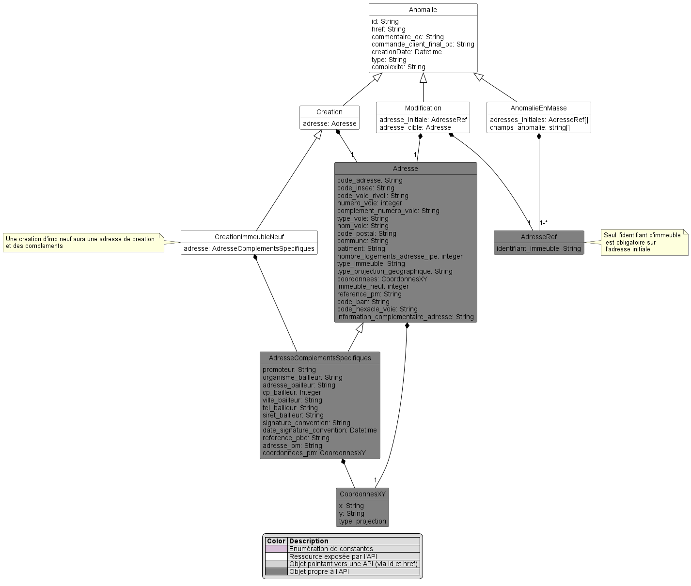
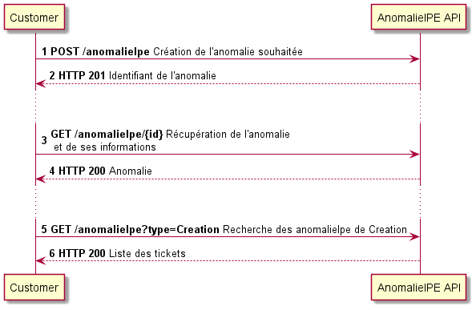
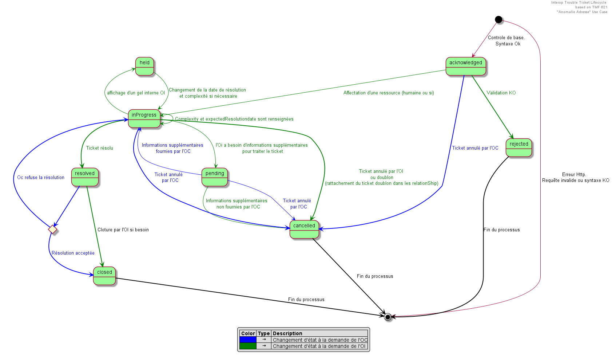
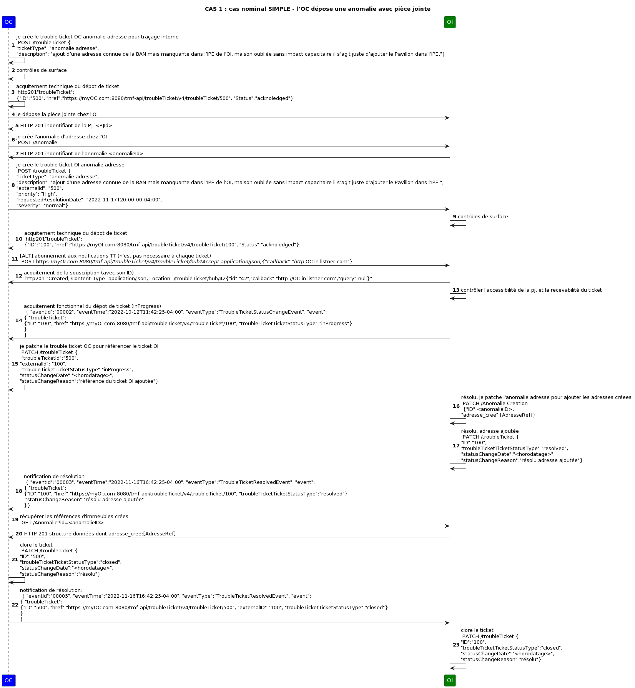
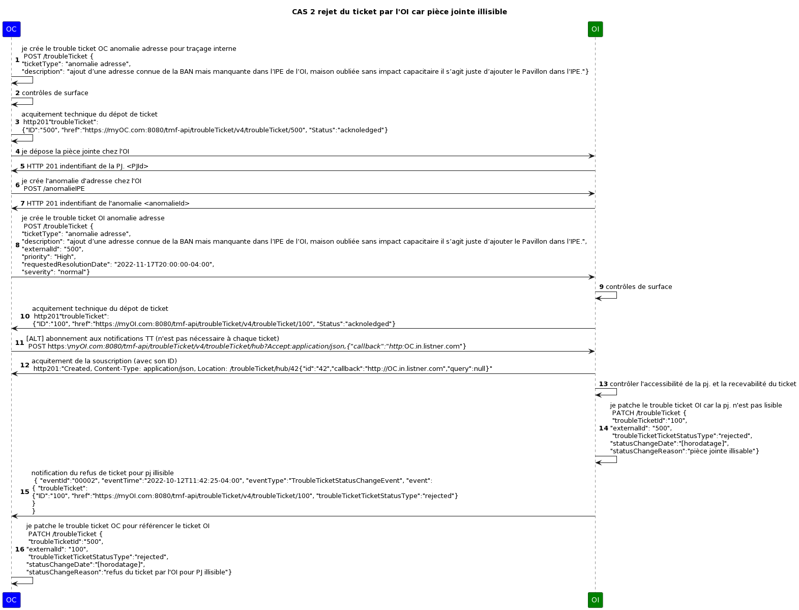
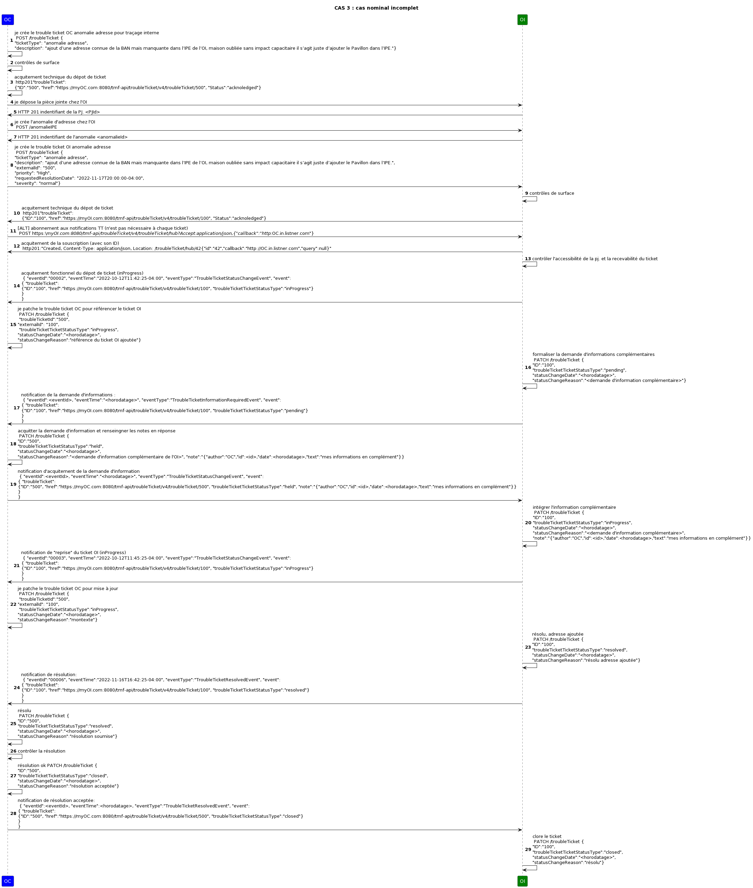
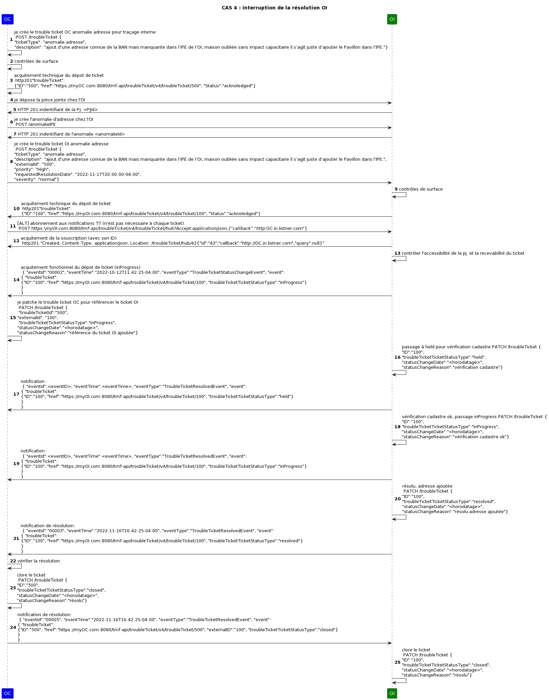
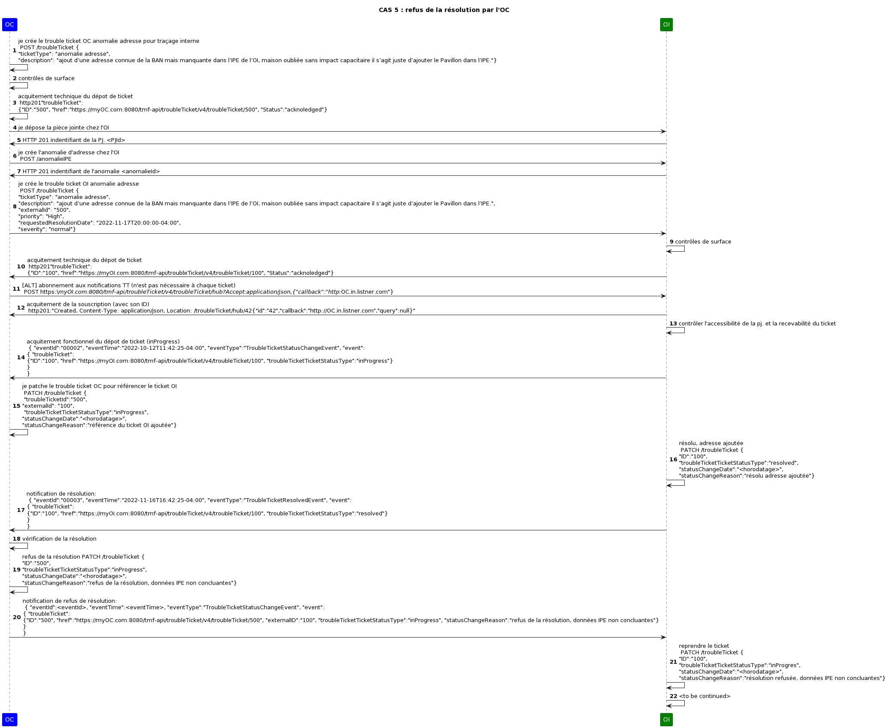
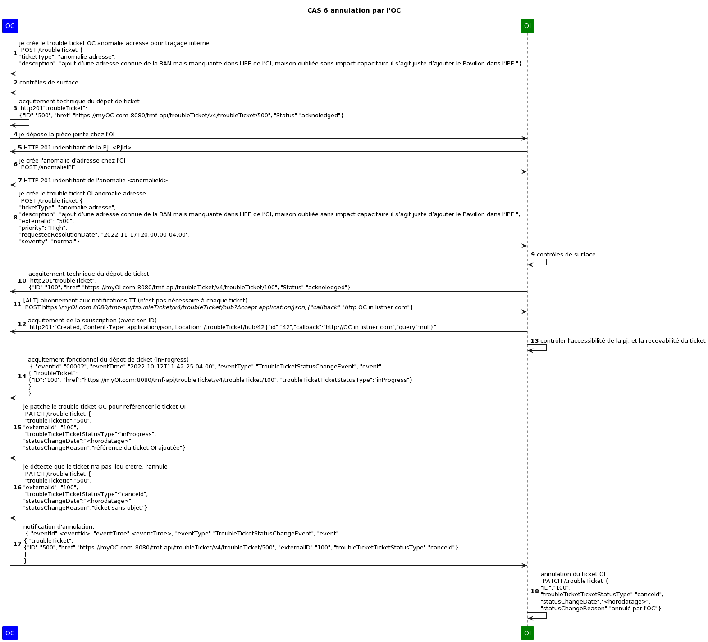

# API de déclaration d'Anomalie Adresse

## Modèle de données

## Description d'une séquence d'appels

## Description du cycle de vie d'un ticket (API Ticketing) rattaché à une anomalie d'adresse

## cas d'usage
### cas nominal

### cas pièce jointe illisible

### cas incomplet

### cas interruption

### cas refus de la résolution par l'OC

### cas annulation par l'OC

