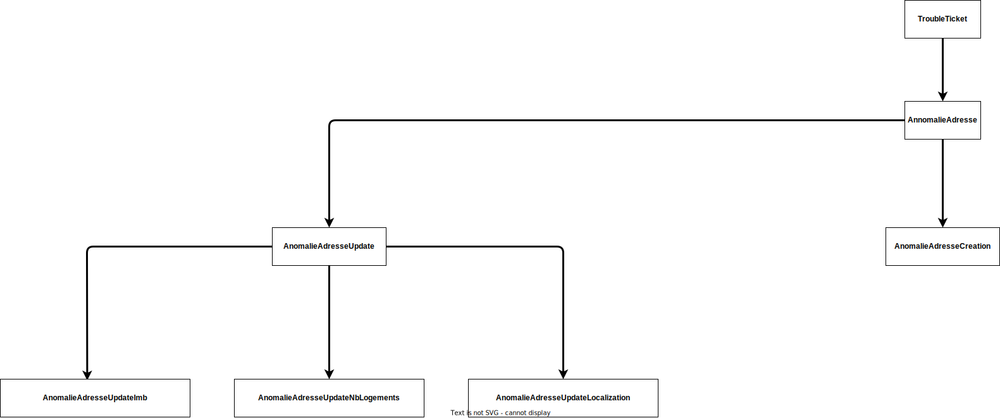
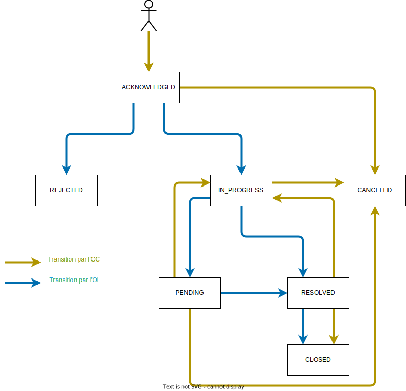
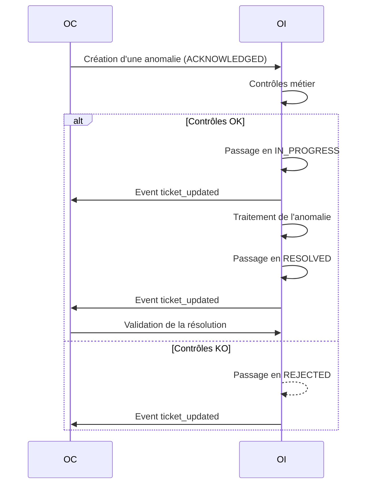

# API AnomalieAdresse

Cet outil a été créé afin de respecter l’obligation réglementaire indiquée dans la [Décision Arcep n° 2020-1432].

Il permet le traitement d’une demande de création ou de modification d’adresses dans les IPE grâce à des flux normalisés.

## Swagger

Le swagger est disponible à l'adresse suivante : https://before-interop.github.io/anomalieAdresse/

TODO: adresse temporaire en attendant le Pull Request sur le repo officiel: https://ggrebert.github.io/anomalieAdresse

## Types d'anomalies



## Cycle de vie d'une anomalie



## Cas d'utilisation

### cas nominal



[Décision Arcep n° 2020-1432]: https://www.arcep.fr/uploads/tx_gsavis/20-1432.pdf


## Exemples d'utilisation de l'API

### Création d'une anomalie

```bash
curl -XPOST -d '{
  "@type": "AnomalieAdresseUpdateImb",
  "externalId": "123456789",
  "code_oi": "FTEL",
  "code_oc": "FTEL",
  "relatedEntity": [
    {
      "id": "ID-75120000012C"
    },
    {
      "id": "ID-7512000000H9"
    }
  ],
  "issues": {
    "building.address.city": {
      "description": "Ville inconnue"
    },
    "building.address.postcode": {
      "value": "75120"
    }
  }
}' https://localhost/api/anomalie-adresse

HTTP/1.1 201 Created
ETag: 123456789abcdef
Location: /api/anomalie-adresse/330e4b53-e426-4ac3-a4c2-1f9f9d875b6a

{
  "id": "330e4b53-e426-4ac3-a4c2-1f9f9d875b6a",
  "externalId": "123456789",
  "code_oi": "FTEL",
  "code_oc": "FTEL",
  "relatedEntity": [
    {
      "id": "ID-75120000012C"
    },
    {
      "id": "ID-7512000000H9"
    }
  ],
  "issues": {
    "building.address.city": {
      "description": "Ville inconnue"
    },
    "building.address.postcode": {
      "value": "75120"
    }
  },
  "sizeRefs": 2,
  "status": "ACKNOWLEDGED",
  "statusChangeReason": null,
  "statusChangeDetails": null,
  "creationDate": "2021-01-01T00:00:00Z",
  "lastUpdateDate": "2021-01-01T00:00:00Z",
  "statusChange": [
    {
      "status": "ACKNOWLEDGED",
      "date": "2021-01-01T00:00:00Z"
    }
  ],
  "severity": "LOW",
  "ticketType": "OC_REQUEST",
  "analysisDelay": null,
  "resolutionDelay": null,
  "@type": "AnomalieAdresseUpdateImb",
  "@baseType": "AnomalieAdresse",
  "@version": "123456789abcdef",
  "href": "/api/anomalie-adresse/330e4b53-e426-4ac3-a4c2-1f9f9d875b6a"
}
```

### Refuser la résolution d'une anomalie

```bash
curl -H "If-Match: 234567890abcdef" -XPUT -d '{
  "status": "IN_PROGRESS",
  "statusChangeReason": "NOT_ACCEPTED",
  "statusChangeDetails": "Ville toujours inconnue",
}' https://localhost/api/anomalie-adresse/330e4b53-e426-4ac3-a4c2-1f9f9d875b6a

HTTP/1.1 200 OK
ETag: 345678901abcdef

{
  "id": "330e4b53-e426-4ac3-a4c2-1f9f9d875b6a",
  "externalId": "123456789",
  "code_oi": "FTEL",
  "code_oc": "FTEL",
  "relatedEntity": [
    {
      "id": "ID-75120000012C"
    },
    {
      "id": "ID-7512000000H9"
    }
  ],
  "issues": {
    "building.address.city": {
      "description": "Ville inconnue"
    },
    "building.address.postcode": {
      "value": "75120"
    }
  },
  "status": "IN_PROGRESS",
  "statusChangeReason": "NOT_ACCEPTED",
  "statusChangeDetails": "Ville toujours inconnue",
  "creationDate": "2021-01-01T00:00:00Z",
  "lastUpdateDate": "2021-01-04T00:00:00Z",
  "statusChange": [
    {
      "status": "ACKNOWLEDGED",
      "date": "2021-01-01T00:00:00Z"
    },
    {
      "status": "IN_PROGRESS",
      "date": "2021-01-02T00:00:00Z"
    },
    {
      "status": "RESOLVED",
      "date": "2021-01-03T00:00:00Z"
    },
    {
      "status": "IN_PROGRESS",
      "date": "2021-01-04T00:00:00Z"
    }
  ],
  "severity": "LOW",
  "ticketType": "OC_REQUEST",
  "analysisDelay": 172800,
  "resolutionDelay": 259200,
  "@type": "AnomalieAdresseUpdateImb",
  "@baseType": "AnomalieAdresse",
  "@version": "345678901abcdef",
  "href": "/api/anomalie-adresse/330e4b53-e426-4ac3-a4c2-1f9f9d875b6a"
}
```

### Récupération des annomalies `PENDING`

```bash
curl "https://localhost/api/anomalie-adresse?status=PENDING"
```

### Récupération des annomalies résolue en plus de 8 semaines

```bash
curl "https://localhost/api/anomalie-adresse?status=RESOLVED&resolutionDelay[gt]=4838400"
```

### Lister les tickets en cours car la résolution n'a pas été acceptée

```bash
curl "https://localhost/api/anomalie-adresse?status=IN_PROGRESS&statusChangeReason=NOT_ACCEPTED"
```

### Lister les tickets ouverts sur un code IMB

```bash
curl "https://localhost/api/anomalie-adresse?status[in]=ACKNOWLEDGED,IN_PROGRESS,PENDING&relatedEntity.id=ID-75120000012C"
```

### Nombre total de tickets ouverts sur le mois de janvier 2021

```bash
curl -XHEAD "https://localhost/api/anomalie-adresse?creationDate[gte]=2021-01-01&creationDate[lt]=2021-02-01"
```

### Nombre total de tickets clôturés sur le mois de janvier 2021 en moins d'une semaine

```bash
curl -XHEAD "https://localhost/api/anomalie-adresse?totalDuration[lt]=604800&resolutionDate[gte]=2021-01-01&resolutionDate[lt]=2021-02-01"
```

### Nombre total de tickets ouverts sur le mois de janvier 2021 et clôturés en moins d'une semaine

```bash
curl -XHEAD "https://localhost/api/anomalie-adresse?status=CLOSED&totalDuration[lt]=604800&creationDate[gte]=2021-01-01&creationDate[lt]=2021-02-01"
```

### Nombre total de tickets clôturés sur le mois de janvier 2021 en plus d'une semaine et moins de 4 semaines

```bash
curl -XHEAD "https://localhost/api/anomalie-adresse?totalDuration[gte]=604800&totalDuration[lt]=2419200&resolutionDate[gte]=2021-01-01&resolutionDate[lt]=2021-02-01"
```

### Nombre total de tickets clôturés sur le mois de janvier 2021 en plus de 4 semaines et moins de 8 semaines

```bash
curl -XHEAD "https://localhost/api/anomalie-adresse?totalDuration[gte]=2419200&totalDuration[lt]=4838400&resolutionDate[gte]=2021-01-01&resolutionDate[lt]=2021-02-01"
```

### Nombre total de tickets clôturés sur le mois de janvier 2021 en plus de 8 semaines

```bash
curl -XHEAD "https://localhost/api/anomalie-adresse?totalDuration[gte]=4838400&resolutionDate[gte]=2021-01-01&resolutionDate[lt]=2021-02-01"
```

### Nombre total de tickets ouverts sur le mois de janvier 2021 et toujours en cours

```bash
curl -XHEAD "https://localhost/api/anomalie-adresse?status[in]=ACKNOWLEDGED,IN_PROGRESS,PENDING,RESOLVED&creationDate[gte]=2021-01-01&creationDate[lt]=2021-02-01"
```

### Nombre total de tickets ouverts sur le mois de janvier 2021 et rejetés

```bash
curl -XHEAD "https://localhost/api/anomalie-adresse?status=REJECTED&creationDate[gte]=2021-01-01&creationDate[lt]=2021-02-01"
```
