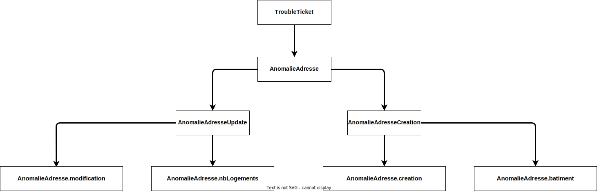
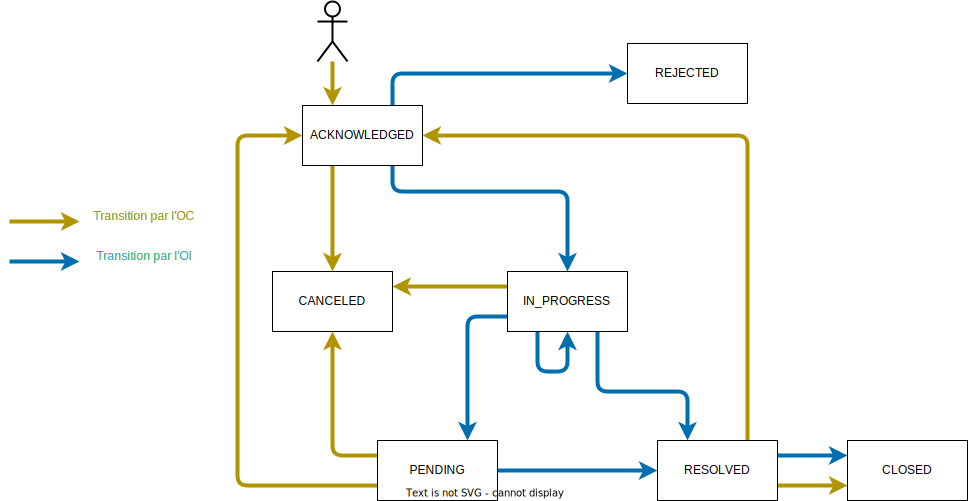

# API AnomalieAdresse

Cet outil a été créé afin de respecter l’obligation réglementaire indiquée dans la [Décision Arcep n° 2020-1432].

Il permet le traitement d’une demande de création ou de modification d’adresses dans les IPE grâce à des flux normalisés.

## Swagger

Le swagger est disponible à l'adresse suivante : https://before-interop.github.io/anomalieAdresse/

## Types d'anomalies

## Cycle de vie d'une anomalie

## Cas d'utilisation

### cas nominal

### Gestion des pièces jointes

[Décision Arcep n° 2020-1432]: https://www.arcep.fr/uploads/tx_gsavis/20-1432.pdf
